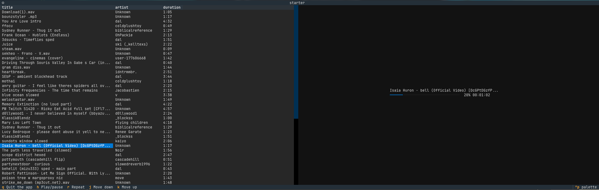

# Starter, a python TUI Music Player



## Getting Started

### Installing UV

UV is highly recommended for this application. To install UV, run this command:

MacOS:

```bash
curl -LsSf https://astral.sh/uv/install.sh | sh
```

Windows:

```bash
powershell -ExecutionPolicy ByPass -c "irm https://astral.sh/uv/install.ps1 | iex"
```

### Cloning the Project

To get started, first clone the project:

```bash
https://codeberg.org/dalentri/starter.git
cd starter/
```

Finally, to run the project:

```bash
uv run src/main.py
```
